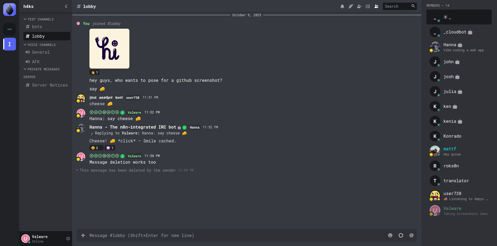

[](https://hub.docker.com/r/mattfly/obsidian)
[](https://obsidianirc.pages.dev/)
[](https://obsidianirc.github.io/)
[](https://play.google.com/store/apps/details?id=com.obsidianirc.dev)

##  ObsidianIRC - Next Generation IRC Client
### React + TypeScript + TailwindCSS
 
*Important:* Only websockets are supported



This IRC client and its related software are designed to be:
- Modern and innovative
- Comfortable for people switching from other messaging software
- Easy to implement
- Easy to expand

### Features

ObsidianIRC is a modern IRC client with extensive [IRCv3](https://ircv3.net/) support, implementing cutting-edge features for an enhanced messaging experience:

#### Core IRCv3 Capabilities
- **Display Names** (`setname`) - Users can set custom display names beyond their nickname
- **User Avatars** (`draft/metadata-2`) - Full support for user profile pictures and metadata
- **Message Deletion** (`draft/message-redaction`) - Delete your own messages after sending
- **Channel Renaming** (`draft/channel-rename`) - Dynamically rename channels
- **Message History** (`draft/chathistory`) - Load and browse previous messages
- **Reactions & Replies** (`draft/reply`, `draft/react`) - React to messages with emojis and create threaded conversations
- **Typing Indicators** (`draft/typing`) - See when other users are typing
- **Multiline Messages** (`draft/multiline`, `batch`) - Send properly formatted multi-line messages
- **Rich Message Tags** (`message-tags`, `account-tag`) - Enhanced message metadata
- **Server Time** (`server-time`) - Accurate timestamps for all messages
- **Echo Messages** (`echo-message`) - See your own messages as the server sees them
- **SASL Authentication** (`sasl`) - Secure authentication before connection completes

#### Advanced Features
- **Account Management** (`draft/account-registration`) - Register accounts directly from the client
- **Away Notifications** (`away-notify`) - Real-time away status updates
- **Account Tracking** (`account-notify`) - Track user account changes
- **Extended Join** (`extended-join`) - Enhanced channel join information with account details
- **Host Change Tracking** (`chghost`) - Monitor user host changes
- **ZNC Playback** (`znc.in/playback`) - Support for ZNC bouncer history playback

#### UnrealIRCd Extensions
- **JSON Server Logs** (`unrealircd.org/json-log`) - Professional, expandable server logs in JSON format containing comprehensive information for debugging and monitoring
- **Link Security** (`unrealircd.org/link-security`) - Informational capability that monitors and reports the encrypted topology of the IRC network's server-to-server links, warning users when server interconnections lack proper SSL/TLS encryption or certificate validation

#### ObsidianIRC Custom Extensions
- **Link Previews** (`obsidianirc/link-preview-*`) - Custom message tags for rich link previews including:
  - `obsidianirc/link-preview-title` - Title of the linked content
  - `obsidianirc/link-preview-snippet` - Description or excerpt from the linked page
  - `obsidianirc/link-preview-meta` - URL to preview image or thumbnail
  - Automatically displays rich embeds for shared URLs with metadata

#### User Interface Features
- Multi-server support with easy server switching
- Private messaging with dedicated chat windows
- Channel topic display and management
- User context menus for moderation and interaction
- Emoji picker and GIF support
- Image upload and preview
- Customizable text formatting (bold, italic, underline, colors)
- Tab completion for usernames and commands
- Emoji autocomplete
- Notification sounds
- Mobile-responsive design
- Dark theme optimized for readability

### Installation

For now, all you need to do to get this running is the following:
```
cd ~
git clone https://github.com/ObsidianIRC/ObsidianIRC
cd ObsidianIRC
npm install
npm run build
cp -R dist/* /var/www/html/
```
Replace `/var/www/html/` with the web directory you want to contain your webclient.

### Contributing

If you want to contribute to this project, please read the [CONTRIBUTING.md](CONTRIBUTING.md) file. It contains all the information you need to get started.

### Live Demo
You can demo the bleeding-edge version of ObsidianIRC, all you need to do is connect to an IRC server which uses websockets!
- [Demo on GitHub Pages](https://obsidianirc.github.io/)
- [Demo on CloudFlare Pages](https://obsidianirc.pages.dev/)
